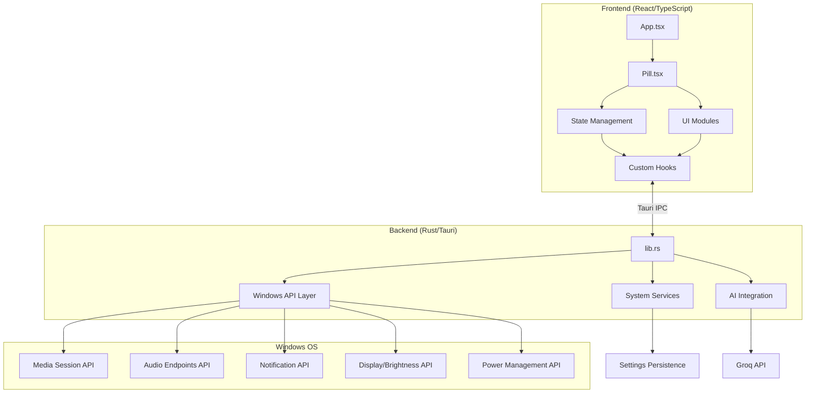
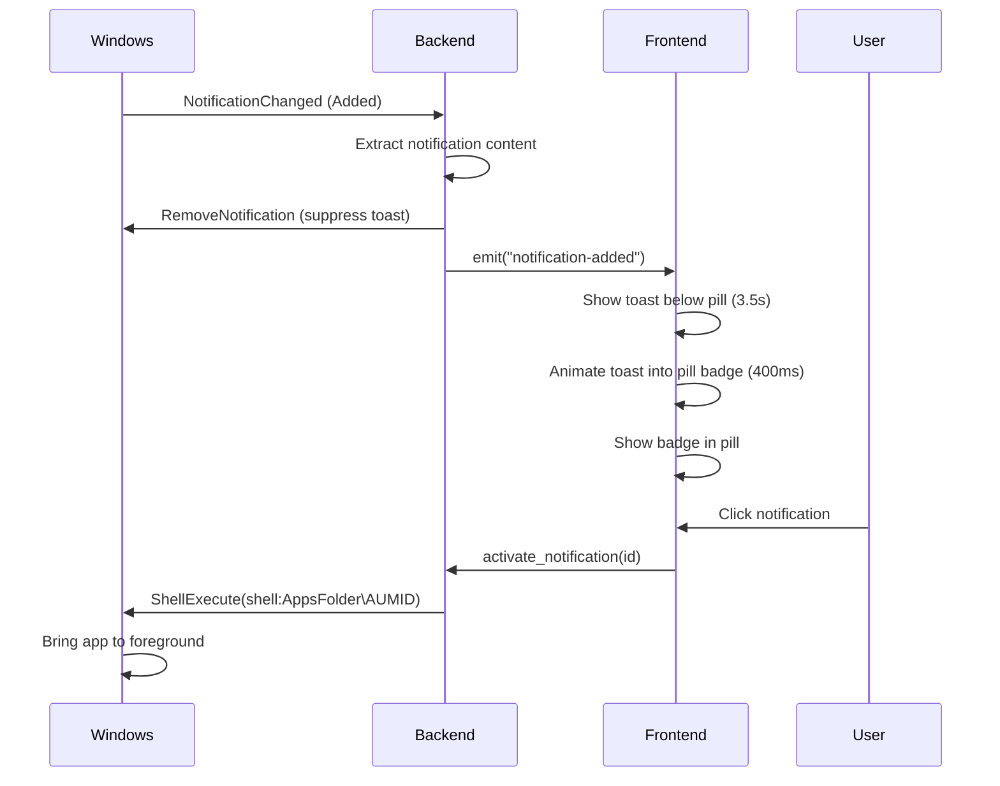

# PILLAR - Dynamic Island: Architecture Analysis

## Executive Summary

PILLAR is a Windows desktop application that implements Apple's Dynamic Island concept as a system overlay. Built with Tauri 2.0 (Rust backend) and React 18 (TypeScript frontend), it provides a sleek, always-on-top interface for managing system notifications, media playback, timers, volume, brightness, and AI-powered interactions.

---

## 1. Technical Stack Overview

### Frontend Stack
- **Framework**: React 18.3.1 with TypeScript 5.7+
- **Build Tool**: Vite 6.0.7
- **Styling**: Tailwind CSS 3.4.17 with PostCSS
- **Animations**: Motion 11.15.0 (Framer Motion)
- **Desktop Bridge**: @tauri-apps/api 2.2.0

### Backend Stack
- **Framework**: Tauri 2.0 (Rust)
- **Language**: Rust 2021 edition
- **Windows API Integration**: windows-rs 0.58
- **HTTP Client**: reqwest 0.12 (rustls-tls)
- **Serialization**: serde 1.0, serde_json 1.0
- **Auto-start Plugin**: tauri-plugin-autostart 2.0
- **Brightness Control**: brightness 0.8 (WMI for laptops)

### Build & Distribution
- **Package Manager**: npm
- **Target Platforms**: Windows 10/11 (primary), Android (experimental)
- **Distribution**: MSIX for Windows, APK for Android

---

## 2. System Architecture

### 2.1 High-Level Architecture



### 2.2 Window Management

The application uses a borderless, transparent overlay window with these characteristics:

| Property | Value | Purpose |
|----------|--------|---------|
| `transparent` | `true` | Allows background visibility |
| `decorations` | `false` | Removes title bar |
| `alwaysOnTop` | `true` | Stays above other windows |
| `skipTaskbar` | `true` | Hidden from taskbar/Alt+Tab |
| `resizable` | `false` | Fixed dimensions |
| `shadow` | `false` | No window shadow |
| `center` | `false` | Custom positioning |

**Positioning Logic**:
- Window positioned at top-center of primary monitor
- Repositions on display changes and window focus events
- Auto-hides during fullscreen content (games, video players)
- DPI-aware scaling via Tauri's LogicalSize

---

## 3. Frontend Architecture

### 3.1 Component Structure

```
src/
├── App.tsx                          # Main app, fullscreen detection
├── components/
│   └── Pill/
│       ├── Pill.tsx                  # Main pill container (1082 lines)
│       ├── animations.ts              # Animation configurations
│       ├── indicators/
│       │   └── StateIndicators.tsx   # Visual state indicators
│       └── modules/
│           ├── AppearanceModule.tsx    # Theme/mode settings
│           ├── BatteryModule.tsx      # Battery status display
│           ├── MediaModule.tsx        # Media controls UI
│           ├── NotificationModule.tsx   # Notification toasts
│           ├── PerAppMixer.tsx       # Per-app volume controls
│           ├── PrismModule.tsx        # AI chat interface
│           ├── TimerModule.tsx        # Timer functionality
│           └── VolumeModule.tsx       # Volume/brightness controls
├── hooks/                           # Custom React hooks (14 hooks)
├── lib/
│   ├── prismContext.ts               # AI context builder
│   └── tauri.ts                   # Tauri IPC wrapper
└── types/
    ├── pill.ts                      # Pill state types
    └── prism.ts                    # AI types
```

### 3.2 State Management Architecture

#### Interaction States (Orthogonal to Content)
```typescript
type InteractionState = "boot" | "idle" | "hover" | "expanded";
```

#### Content States (Priority-Based)
```typescript
type ContentStateType = 
  | "idle"           // Priority: 0
  | "timer_running"  // Priority: 10
  | "notification"    // Priority: 20
  | "media"          // Priority: 30
  | "timer_alert";    // Priority: 40
```

**State Management Pattern**:
- Multiple content states can coexist (e.g., timer + media)
- States sorted by priority for display decisions
- Notifications can stack (multiple active)
- Other content types are mutually exclusive

### 3.3 Custom Hooks Architecture

| Hook | Purpose | Poll Interval |
|------|---------|---------------|
| `usePillState` | Central state management, interaction handling | N/A |
| `useTimer` | Timer logic, presets, alerts | N/A (setInterval) |
| `useMediaSession` | Media playback info, controls | 1500ms |
| `useVolume` | System volume, mute toggle | 5000ms |
| `useBrightness` | Display brightness control | 10000ms |
| `useAudioDevices` | Audio device enumeration | 15000ms |
| `usePerAppMixer` | Per-app volume control | 8000ms |
| `useNotifications` | Notification capture, display | Event-driven + 30s fallback |
| `useBattery` | Battery status, charging state | 60000ms |
| `usePrismAI` | AI chat, context building | N/A (on-demand) |
| `useAppearance` | Theme, opacity, accent color | N/A |
| `useSettings` | Settings persistence | N/A |
| `useAutoStart` | Auto-start toggle | N/A |

**Polling Optimization**:
- In-flight request guards prevent overlapping calls
- Polling pauses when document is hidden (minimized)
- Different intervals based on data change frequency
- Event-driven updates where available (notifications)

### 3.4 Animation System

**Spring Configurations**:
```typescript
const springConfig = {
  default: { stiffness: 220, damping: 25, mass: 1 },
  snappy:   { stiffness: 300, damping: 28, mass: 0.8 },
  gentle:   { stiffness: 180, damping: 22, mass: 1.2 },
  bouncy:   { stiffness: 260, damping: 18, mass: 1 },
};
```

**Pill Dimensions** (Logical, DPI-aware):
- Boot: 8×8px
- Idle: 120×36px (expands with battery/notifications)
- Hover: 160×40px (expands with battery/notifications)
- Expanded: 380×340px

**Reduced Motion Support**:
- Detects `prefers-reduced-motion` media query
- Falls back to instant transitions (0.05-0.15s)
- Disables hover/tap scale effects

---

## 4. Backend Architecture

### 4.1 Tauri Command Structure

The backend exposes 30+ Tauri commands organized by domain:

#### Window Management
- `set_click_through` - Toggle mouse event passthrough
- `resize_window` - Resize to specific dimensions
- `position_window` - Position at top-center
- `resize_and_center` - Atomic resize + center
- `is_foreground_fullscreen` - Detect content fullscreen
- `get_scale_factor` - Get DPI scale factor

#### Media Session
- `get_media_session` - Get now playing info
- `media_play_pause` - Toggle playback
- `media_next` - Skip to next track
- `media_previous` - Skip to previous track
- `get_media_timeline` - Get position/duration
- `seek_media` - Seek to position
- `get_media_playback_info` - Get repeat/shuffle state
- `media_toggle_repeat` - Cycle repeat mode
- `media_toggle_shuffle` - Toggle shuffle
- `pause_other_sessions` - Pause all other media apps
- `extract_accent_color` - Extract color from album art

#### Volume Control
- `get_system_volume` - Get master volume (0-100)
- `set_system_volume` - Set master volume
- `toggle_mute` - Toggle mute state

#### Audio Devices
- `list_audio_devices` - Enumerate output devices
- `get_default_audio_device` - Get default device info

#### Per-App Volume
- `list_audio_sessions` - Get all audio sessions
- `set_session_volume` - Set volume for specific app
- `set_session_mute` - Mute/unmute specific app

#### Brightness Control
- `get_system_brightness` - Get display brightness
- `set_system_brightness` - Set display brightness

#### Notifications
- `check_notification_access` - Check Windows notification access
- `get_notifications` - Get recent notifications
- `dismiss_notification` - Dismiss notification by ID
- `activate_notification` - Activate app from notification
- `activate_app_by_aumid` - Activate app by AUMID

#### Auto-Start
- `check_autostart_enabled` - Check auto-start status
- `set_autostart_enabled` - Enable/disable auto-start

#### Battery
- `get_battery_info` - Get battery status

#### Settings
- `load_settings` - Load from JSON file
- `save_settings` - Save to JSON file

#### AI (Prism)
- `prism_chat` - Send message to Groq API

### 4.2 Windows API Integration

#### Media Session API
```rust
// Uses GlobalSystemMediaTransportControlsSessionManager
GlobalSystemMediaTransportControlsSessionManager::RequestAsync()
  -> GetCurrentSession()
  -> GetPlaybackInfo() / TryGetMediaPropertiesAsync()
```

**Async Polling Pattern**:
- Windows async operations polled with 5ms sleep, max 30 iterations (150ms timeout)
- Prevents blocking the Rust thread while waiting for WinRT operations

#### Audio API (Core Audio)
```rust
// Uses IMMDeviceEnumerator for device enumeration
CoCreateInstance(&MMDeviceEnumerator)
  -> GetDefaultAudioEndpoint(eRender, eConsole)
  -> Activate(CLSCTX_ALL) -> IAudioEndpointVolume
```

**Per-App Volume**:
```rust
// Uses IAudioSessionManager2 for session enumeration
device.Activate(CLSCTX_ALL) -> IAudioSessionManager2
  -> GetSessionEnumerator() -> IAudioSessionEnumerator
  -> GetSession(i) -> IAudioSessionControl2
  -> cast() -> ISimpleAudioVolume
```

#### Notification API
```rust
// Uses UserNotificationListener for real-time capture
UserNotificationListener::Current()
  -> RequestAccessAsync() -> UserNotificationListenerAccessStatus
  -> NotificationChanged event handler
  -> GetNotificationsAsync(NotificationKinds::Toast)
```

**Event-Driven Architecture**:
- Subscribes to `NotificationChanged` event with retry logic (3 attempts)
- On `Added` event: extracts notification, dismisses from Windows, emits to frontend
- Fallback: 30-second polling if event subscription fails

#### Display/Brightness API
```rust
// Primary: WMI via brightness crate (laptops)
brightness::blocking::brightness_devices()
  -> device.get() / device.set(level)

// Fallback: DDC/CI (external monitors)
GetPhysicalMonitorsFromHMONITOR()
  -> GetMonitorBrightness() / SetMonitorBrightness()
```

#### Power Management API
```rust
// Uses Win32 GetSystemPowerStatus (no WinRT)
GetSystemPowerStatus(&mut SYSTEM_POWER_STATUS)
  -> BatteryLifePercent (0-100, 255 = unknown)
  -> BatteryFlag (bit 128 = no battery, bit 8 = charging)
  -> SystemStatusFlag (bit 1 = battery saver)
```

### 4.3 Settings Persistence

**Storage Location**: `%APPDATA%\PILLAR\settings.json`

**Settings Structure**:
```typescript
interface AppSettings {
  appearance: {
    mode: "island" | "notch";
    opacity: number;           // 0-100
    accentColor: string;       // Hex color
    useAlbumAccent: boolean;   // Extract from album art
  };
  motion: {
    animationSpeed: number;     // Multiplier
    reducedMotionOverride: "system" | "on" | "off";
  };
  behavior: {
    launchAtStartup: boolean;
    pauseOtherSessions: boolean;
  };
  timer: {
    lastCustomLabel: string;
    lastCustomMinutes: number;
  };
}
```

---

## 5. Data Structures

### 5.1 Core Types

#### Media Info
```typescript
interface MediaInfo {
  title: string;
  artist: string;
  album?: string;
  isPlaying: boolean;
  appName?: string;
}
```

#### Volume Info
```typescript
interface VolumeInfo {
  level: number;      // 0-100
  isMuted: boolean;
}
```

#### Audio Device
```typescript
interface AudioDevice {
  id: string;
  name: string;
  isDefault: boolean;
}
```

#### Audio Session
```typescript
interface AudioSession {
  sessionId: string;    // Process ID as string
  appName: string;
  processId: number;
  volume: number;      // 0.0-1.0
  isMuted: boolean;
  isActive: boolean;   // Currently playing audio
}
```

#### System Notification
```typescript
interface SystemNotification {
  id: number;
  appName: string;
  title: string;
  body: string;
  timestamp: number;   // Unix ms
  aumid?: string;      // App User Model ID
}
```

#### Battery Info
```typescript
interface BatteryInfo {
  percent: number;
  isCharging: boolean;
  isBatterySaver: boolean;
  hasBattery: boolean;
}
```

#### Brightness Info
```typescript
interface BrightnessInfo {
  level: number;        // 0-100
  min: number;
  max: number;
  isSupported: boolean;
}
```

### 5.2 AI (Prism) Types

#### Chat Message
```typescript
interface PrismChatMessage {
  id: string;
  role: "user" | "assistant";
  content: string;
  timestamp: number;
}
```

#### Context Block
```typescript
interface PrismContextBlock {
  kind: string;    // e.g., "timer", "media", "volume"
  content: string;
}
```

#### Action
```typescript
interface PrismAction {
  id?: string;
  type: string;     // e.g., "start_timer", "set_volume"
  label?: string;
  description?: string;
  args?: Record<string, unknown>;
}
```

**Supported Action Types**:
- `start_timer`, `pause_timer`, `resume_timer`, `stop_timer`
- `set_volume`, `toggle_mute`
- `set_brightness`
- `media_play_pause`, `media_next`, `media_previous`

---

## 6. System Logic & Feature Implementations

### 6.1 Fullscreen Detection

**Algorithm**:
1. Get foreground window handle via `GetForegroundWindow()`
2. Get window rectangle via `GetWindowRect()`
3. Check if window covers 90%+ of monitor
4. Check window style: `WS_POPUP` or no `WS_CAPTION` = content fullscreen
5. Return true only for content fullscreen (games, video players)

**Purpose**: Hide pill during immersive content (YouTube fullscreen, games) but not during browser F11 or maximized windows.

### 6.2 Notification Flow



**Animation Phases**:
1. `incoming` - Toast appears below pill (3.5s)
2. `absorbing` - Toast shrinks and moves into pill (400ms)
3. `showing` - Badge visible in pill, toast gone

### 6.3 Media Session Integration

**Polling Strategy**:
- Poll every 1.5s for media info (reduced from 600ms)
- Poll timeline/playback info on-demand when expanded
- In-flight guard prevents overlapping requests

**Auto-Pause Feature**:
- When enabled, pauses all other media sessions when new track starts
- Uses `pause_other_sessions()` command
- Compares current title with previous to detect track changes

### 6.4 Album Art Accent Color

**Extraction Process**:
1. Get current media session thumbnail stream
2. Read all bytes via `DataReader`
3. Sample every 16th pixel (skip first 100 bytes)
4. Filter out very dark (<60) and very bright (>700) pixels
5. Calculate average RGB
6. Return hex color

**Fallback**: Gray (#808080) if no valid pixels found.

### 6.5 Timer System

**Presets**:
- Pomodoro: 25min work / 5min break
- Deep Work: 50min work / 10min break
- Quick Focus: 15min work / 3min break

**Alert Flow**:
1. Timer completes → `isComplete = true`
2. Show "Done!" in red with glow effect
3. User dismisses → reset timer state

### 6.6 Per-App Volume Mixer

**Session Enumeration**:
1. Get default audio endpoint
2. Get session manager
3. Enumerate all sessions
4. Skip system sounds (PID 0)
5. Get process ID, display name, volume, mute state
6. Sort: active first, then alphabetically

**Control**:
- Volume slider: 0.0-1.0 range
- Mute toggle per session
- Updates reflected immediately in UI

### 6.7 AI (Prism) Integration

**Context Building**:
- Collects current state from all hooks
- Creates context blocks: timer, media, volume, brightness, notifications, audio sessions, auto-start, battery
- Limits to 8 blocks, 400 chars each

**API Integration**:
- Uses Groq API with `openai/gpt-oss-20b` model
- Temperature: 0.2 (focused responses)
- Max tokens: 320
- System prompt enforces JSON output format

**Action Execution**:
- AI returns structured actions with type, label, description, args
- Frontend validates action types
- User clicks action → executes corresponding Tauri command

---

## 7. Performance Optimizations

### 7.1 Polling Strategy
- Variable intervals based on data change frequency
- In-flight request guards prevent overlapping calls
- Polling pauses when document hidden
- Event-driven updates where available (notifications)

### 7.2 Memory Management
- Limited notification history (10 items)
- Limited chat history (12 messages)
- Limited context blocks (8 blocks)
- Truncated message content (800 chars max)

### 7.3 CPU Optimization
- Reduced motion support disables animations
- Clock ticks only when pill visible
- Fullscreen check throttled to 1s
- Async operations polled with 5ms sleep (not busy-wait)

### 7.4 Network Optimization
- HTTP client with 15s timeout
- Rustls TLS (no OpenSSL dependency)
- Single HTTP client instance (lazy static)

---

## 8. Security Considerations

### 8.1 API Key Management
- Groq API key via environment variable `GROQ_API_KEY`
- Can be embedded at build time via `option_env!`
- Never stored in source code
- Error message if key not set

### 8.2 Notification Access
- Requires Windows notification access permission
- User must grant in Settings > Privacy > Notifications
- Cached access status to avoid repeated checks
- Graceful fallback to polling if access denied

### 8.3 System Access
- Requires elevated privileges for:
  - Audio session enumeration
  - Brightness control (DDC/CI)
  - Notification interception
- No admin rights required for basic functionality

---

## 9. Cross-Platform Considerations

### 9.1 Windows (Primary)
- Full feature support
- Uses Windows-specific APIs via `windows-rs`
- MSIX packaging for distribution

### 9.2 Android (Experimental)
- Limited feature set
- Most Windows-specific commands return errors
- APK packaging available
- Touch-optimized UI needed

### 9.3 Future Platforms
- macOS: Possible with Core Audio, Media Remote Control
- Linux: Possible with PulseAudio, MPRIS D-Bus

---

## 10. Known Limitations

1. **Brightness Control**: DDC/CI not supported on all monitors
2. **Notification Access**: Some systems don't support `NotificationChanged` event
3. **Per-App Volume**: Some apps don't expose audio sessions
4. **Media Controls**: Only works with apps that support Media Transport Controls
5. **Fullscreen Detection**: May misclassify some borderless windows
6. **AI Actions**: Limited to predefined action types
7. **Battery Info**: Desktops without batteries show 0%

---

## 11. Development Workflow

### Build Commands
```bash
npm run dev              # Start Vite dev server
npm run build           # Build for production
npm run tauri dev       # Run Tauri app in dev mode
npm run tauri build     # Build Tauri app for production
npm run icons           # Generate app icons
```

### Environment Setup
```powershell
# Set Groq API key for AI features
$env:GROQ_API_KEY = "your_key_here"
npm run tauri dev
```

---

## 12. Dependencies Summary

### Frontend
- `react` 18.3.1 - UI framework
- `motion` 11.15.0 - Animation library
- `@tauri-apps/api` 2.2.0 - Desktop bridge
- `tailwindcss` 3.4.17 - Styling
- `typescript` 5.7.3 - Type safety

### Backend
- `tauri` 2.0 - Desktop framework
- `windows` 0.58 - Windows API bindings
- `serde` 1.0 - Serialization
- `reqwest` 0.12 - HTTP client
- `brightness` 0.8 - Brightness control
- `tauri-plugin-autostart` 2.0 - Auto-start

---

## Conclusion

PILLAR demonstrates a sophisticated hybrid architecture combining React's declarative UI with Rust's performance and Windows API integration. The modular design, priority-based state management, and optimized polling strategy create a responsive, resource-efficient system overlay that enhances Windows productivity while maintaining near-zero idle resource usage.
