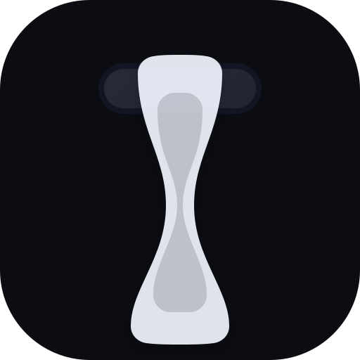

<div align="center">
  

  <h1>PILLAR — Dynamic Island for Windows</h1>

  <p><strong>A free, open-source Dynamic Island for Windows 10 &amp; 11.</strong><br/>
  Media controls, focus timers, live notifications, system stats, a per-app volume mixer,
  and a private AI assistant — in one sleek, always-on-top pill at the top of your screen.</p>

  <p>
    <a href="https://github.com/warpirate/pillar-dynamic-island-for-windows/releases/latest"></a>
  </p>

  <p>
    <a href="https://github.com/warpirate/pillar-dynamic-island-for-windows/releases"></a>
    <a href="LICENSE"></a>
    
    <a href="https://tauri.app/"></a>
    <a href="https://react.dev/"></a>
    
  </p>

  <p>
    <a href="https://pillar-dynamic-island.vercel.app"><strong>🌐 Website</strong></a> ·
    <a href="https://github.com/warpirate/pillar-dynamic-island-for-windows/releases/latest"><strong>⬇️ Download</strong></a> ·
    <a href="#-features"><strong>Features</strong></a> ·
    <a href="#-build-from-source"><strong>Build from source</strong></a>
  </p>
</div>

---

**PILLAR** brings Apple's **Dynamic Island** experience to **Windows**. It's a borderless, transparent,
always-on-top overlay that sits at the top-center of your screen and stays invisible until you need it —
**hover to peek, click to expand**. Inside the pill: now-playing media controls, Pomodoro focus timers,
real-time Windows notifications, CPU/RAM system stats, system &amp; per-app volume, brightness, battery,
a context-aware **AI assistant (Prism)**, and a lightweight tasks/notes/agenda tab. Built with
**Tauri 2 + React + Rust** for a tiny (~3 MB), fast, low-resource desktop app.

> Looking for a **Dynamic Island for Windows 11**, a **Windows menu bar / notch overlay**, or a
> **media + notification widget for Windows**? That's PILLAR.

## ⬇️ Download

Grab the latest installer from **[GitHub Releases](https://github.com/warpirate/pillar-dynamic-island-for-windows/releases/latest)**:

- **`PILLAR_x.y.z_x64-setup.exe`** — recommended installer (NSIS)
- **`PILLAR_x.y.z_x64_en-US.msi`** — MSI installer (managed/enterprise installs)

Windows 10/11, 64-bit. The build is unsigned open-source — if SmartScreen appears, choose
**More info → Run anyway**. No account, no telemetry.

## ✨ Features

- 🎵 **Media controls** — play/pause, skip, scrub any app's audio via Windows SMTC; album art tints the pill
- ⏱️ **Focus timers** — Pomodoro-style timers with a progress ring and a desktop alert on completion
- 🔔 **Notifications** — live toast notifications that fold into the pill, with a clearable history
- 🔊 **Volume &amp; per-app mixer** — system volume, per-application volume, output-device switching
- 🖥️ **System monitor** — live CPU and RAM usage, right in the Settings tab
- 🔆 **Brightness &amp; battery** — quick brightness control and battery status at a glance
- 🤖 **Prism AI** — a private assistant that knows **which app you're in** (active app name + window title only — never your content, no screenshots) and can run actions
- ✅ **Productivity** — quick tasks, notes, and an agenda, stored locally
- ♿ **Accessible** — full keyboard navigation, screen-reader announcements, reduced-motion support
- ⚡ **Lightweight** — ~3 MB, Rust backend, adaptive polling that sleeps when idle; near-zero CPU when idle
- 🪟 **Native feel** — borderless, transparent, always-on-top, hidden from taskbar &amp; Alt+Tab, DPI-aware, hides during fullscreen apps/games

## 🖼️ Screenshots

See the live, interactive preview on the **[website »](https://pillar-dynamic-island.vercel.app)**.

<!-- Add real screenshots/GIFs here, e.g.:
<div align="center">
  
  
</div>
-->

## 🛠️ Tech stack

- **Frontend:** React 18, TypeScript, Tailwind CSS, Motion (Framer Motion)
- **Backend:** Tauri 2 (Rust) — Win32 / WinRT for media, audio, notifications, system stats
- **Build:** Vite

## 🚀 Build from source

### Prerequisites

- Windows 10/11
- [Node.js](https://nodejs.org/) 18+
- [Rust](https://rustup.rs/) (for the Tauri backend)

### Steps

```bash
# 1. Clone
git clone https://github.com/warpirate/pillar-dynamic-island-for-windows.git
cd pillar-dynamic-island-for-windows

# 2. Install dependencies
npm install

# 3. Run in development
npm run tauri dev

# 4. Build a production installer
npm run tauri build
```

The installers are written to `src-tauri/target/release/bundle/` (`nsis/` and `msi/`).

### Prism AI (Groq) setup

Prism uses the Groq API from the Tauri backend. Set the key **in the same terminal** you run the app
(or before `npm run tauri build` to embed it in the `.exe`):

```powershell
$env:GROQ_API_KEY = "your_groq_api_key_here"
npm run tauri dev
```

If the key is missing, Prism shows: *"GROQ_API_KEY is not set. Set it before building or running PILLAR."*

## 📁 Project structure

```
pillar-dynamic-island-for-windows/
├── src/                 # React frontend
│   ├── components/      # Pill UI + modules (media, timer, notifications, AI, system monitor…)
│   ├── hooks/           # Custom React hooks (media, volume, notifications, system stats…)
│   ├── lib/             # Tauri bridge, Prism context, productivity store
│   └── App.tsx
├── src-tauri/           # Tauri Rust backend
├── website/             # Landing page (deployed to Vercel)
└── public/              # Static assets
```

## 🤝 Contributing

Contributions are welcome — open an issue or a pull request.

1. Fork the repo
2. Create a feature branch (`git checkout -b feature/amazing-feature`)
3. Commit your changes
4. Push and open a Pull Request

## 📝 License

MIT — see [LICENSE](LICENSE).

## 🙏 Acknowledgments

- Inspired by Apple's **Dynamic Island** design
- Built with [Tauri](https://tauri.app/) · animations by [Motion](https://motion.dev/)

---

<div align="center">
  <sub><strong>PILLAR</strong> — a Dynamic Island for Windows 10 &amp; 11. Free &amp; open source.</sub><br/>
  <a href="https://pillar-dynamic-island.vercel.app">pillar-dynamic-island.vercel.app</a>
</div>
